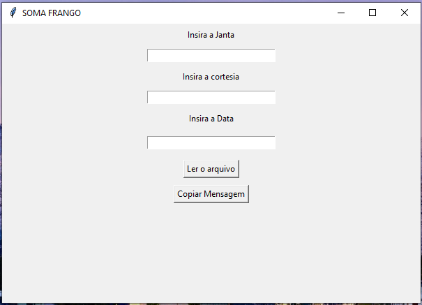
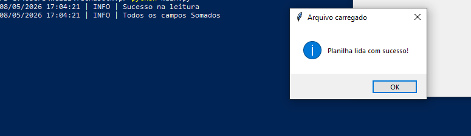
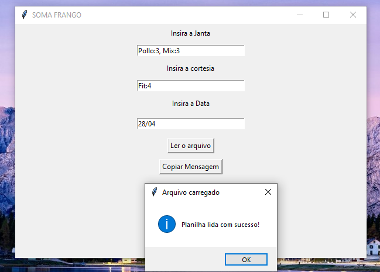
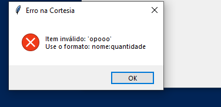
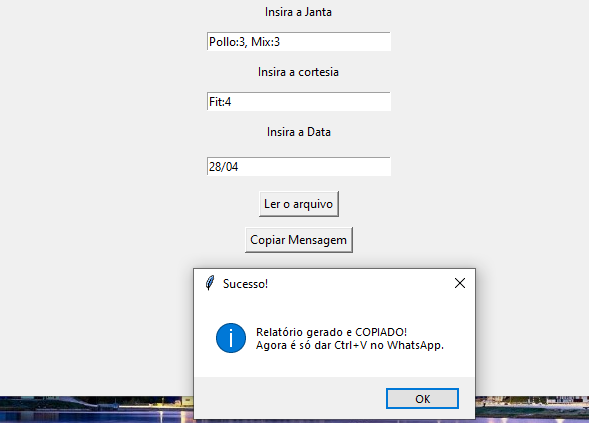

# 🤖 FechaBot MVP — Automação de Fechamento de Loja

> Projeto real desenvolvido e implantado em produção para a loja **Pollo Loko, São José dos Campos - SP**.

---

## 📌 O Problema

A funcionária responsável pelo fechamento diário precisava:

- Abrir a planilha de vendas gerada pelo sistema da loja
- Somar manualmente cada categoria de produto (Inteira, Meia, Mix, Asa)
- Redigir a mensagem do zero no WhatsApp
- Enviar para o grupo da gestão

Esse processo levava entre **15 a 20 minutos por dia**, era sujeito a erro humano no cálculo e gerava mensagens sem padrão visual entre turnos.

---

## ✅ A Solução

Executável portátil (`.exe`) que lê a planilha de vendas, processa os dados automaticamente e gera a mensagem formatada pronta para colar no WhatsApp — **em menos de 30 segundos**.

---

## 📦 Instalação

```bash
pip install -r requirements.txt
```

---

## 🖥️ Interface







---

## ⚙️ Como funciona

1. A usuária abre o `SomaFrango_v2.exe` — sem instalação necessária
2. Preenche os campos variáveis do dia: **Janta** e **Cortesia**
3. Insere a data no formato `dd/mm`
4. Clica em **Ler o arquivo** e seleciona a planilha `.xlsx` do dia
5. Clica em **Copiar Mensagem**
6. Cola no WhatsApp com `Ctrl+V`

---

## 📋 Exemplo de mensagem gerada

```
data 28/04
*INTEIRA*
Fit: 42
Pollo: 89
Sobrecoxa: 15
Mix: 34
Asa: 22

*MEIA*
1/2 Pollo: 67
1/2 fit: 38
1/2 sobrecoxa: 12

*JANTA*
Pollo: 3
Mix: 4
1/2 fit: 6

*CORTESIA*
Fit: 2
```

---

## 🗂️ Estrutura do projeto

```
FECHABOTMVP/
├── assets/                     # Screenshots da interface
├── reader/
│   ├── __init__.py
│   └── excel_reader.py         # Leitura e processamento da planilha com Pandas
├── UI/
│   ├── __init__.py
│   └── interface.py            # Interface gráfica com Tkinter
├── utils/
│   └── logger.py               # Sistema de logs com TimedRotatingFileHandler
├── logs/                       # Gerado automaticamente — não versionado
├── dist/
│   └── SomaFrango_v2.exe       # Executável gerado com PyInstaller
├── requirements.txt
├── main.py
└── SomaFrango_v2.spec
```

---

## 🛠️ Stack

| Tecnologia | Uso |
|---|---|
| Python 3.x | Linguagem principal |
| Pandas | Leitura e processamento da planilha Excel |
| Regex | Filtro e validação de campos por palavras-chave |
| Tkinter | Interface gráfica desktop |
| PyInstaller | Empacotamento como executável `.exe` portátil |
| Logging / TimedRotatingFileHandler | Registro de atividades com rotação diária |

---

## 📁 Decisões técnicas

**Regex com `case=False`**
Todos os filtros de produto usam `str.contains(case=False)`, garantindo que variações de capitalização na planilha não quebrem o processamento.

**Separação de camadas**
A lógica de leitura (`ExcelReader`) é independente da interface (`APP`). Erros são logados na camada de dados e exibidos visualmente na camada de interface — cada responsabilidade no lugar certo.

**Logs com rotação automática**
`TimedRotatingFileHandler` com `backupCount=7` mantém apenas os últimos 7 dias de log, evitando acúmulo de arquivos na máquina da cliente e facilitando suporte remoto.

**Tratamento de erros em cascata**
Arquivo inválido → retorna `None` → interface exibe erro visual. A usuária nunca recebe uma mensagem com zeros sem aviso.

**Executável portátil**
Distribuído como `.exe` único via PyInstaller. Não exige instalação de Python nem dependências — a cliente usa direto.

---

## 🚀 Status

✅ Em produção — implantado e em uso diário na Pollo Loko, São José dos Campos.

---

## 🔒 Privacidade

Nenhum dado da loja está presente neste repositório. Planilhas, logs e arquivos de configuração estão no `.gitignore`. O projeto foi publicado com autorização.

---

## 👨‍💻 Autor

**Wellington Roveder**
Estudante de Ciência da Computação
[LinkedIn](https://www.linkedin.com/in/wellington-roveder-04637b37b/) · [GitHub](https://github.com/Wellington-Roveder)

> Este projeto faz parte de um ecossistema maior. A **Versão SaaS** (em desenvolvimento) utiliza Docker, Evolution API e PostgreSQL para envio automático via WhatsApp sem interação do usuário, com suporte a múltiplas lojas.